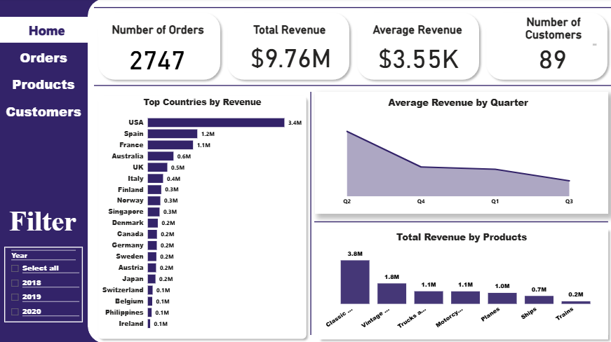
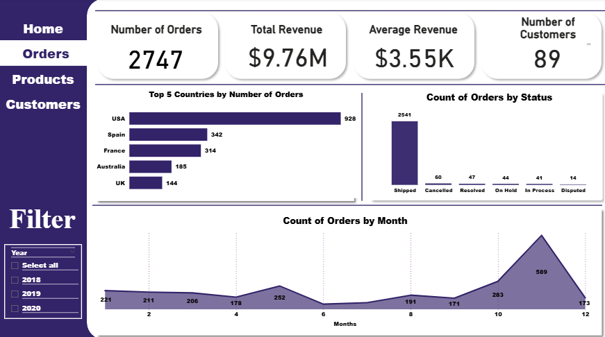
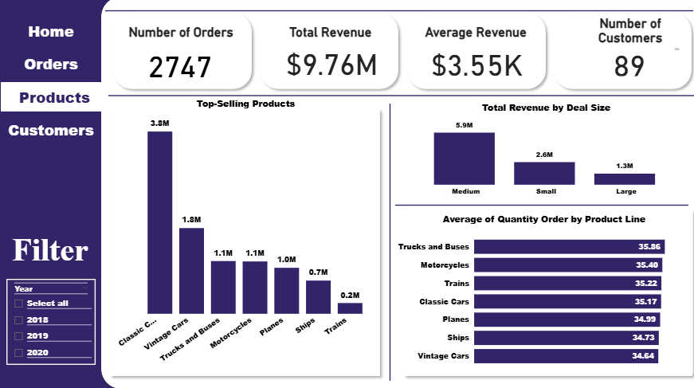
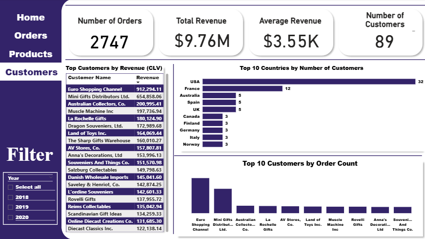

# E-Commerce Analysis 

This project is an interactive Power BI dashboard that analyzes key metrics for an e-commerce dataset. 
The analysis focuses on product performance, customer behavior, and order trends, with the goal of helping business leaders make data-driven decisions.

## Project Goals
- Analyze sales performance and identify top-selling products
- Examine customer insights and purchasing behaviors
- Track order trends by region, time, and product category
- Understand the impact of promotional activities on sales

## Data Preparation
- Cleaned and transformed data using Power Query to ensure integrity  
- Handled missing values and corrected inconsistencies  
- Filtered out irrelevant data, such as out-of-date or incomplete orders  

## Key Insights
- Top Countries by Sales: Identified the regions driving the most revenue  
- Product Performance: Highlighted the best-selling products by quantity and revenue  
- Order Trends: Analyzed orders by month, quarter, and year to spot trends  
- Customer Insights: Categorized customers based on order history and behavior  

## Tools Used
- Power BI – For the creation of interactive visualizations and KPIs  
- Power Query – For data transformation and cleaning  
- DAX – For calculated columns and measures to analyze trends  

## Outcome
An interactive Power BI dashboard that helps e-commerce managers:
- Track sales trends and product performance  
- Identify top-performing regions and customers  
- Make informed decisions about inventory, marketing, and promotions

 ## Dashboard Preview

